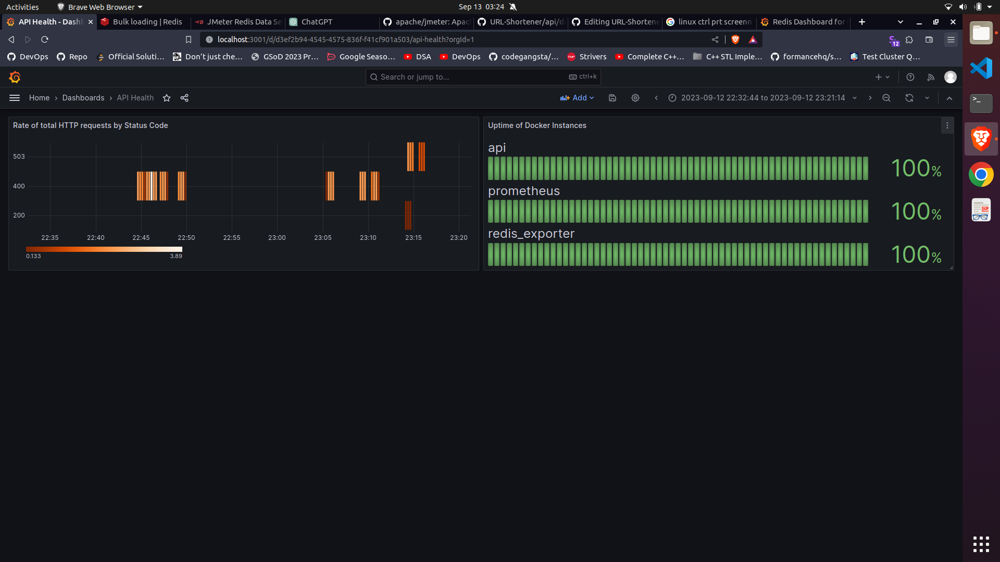
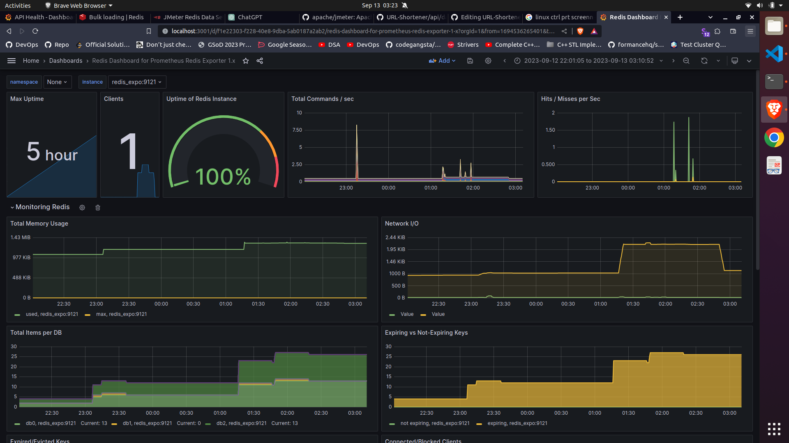
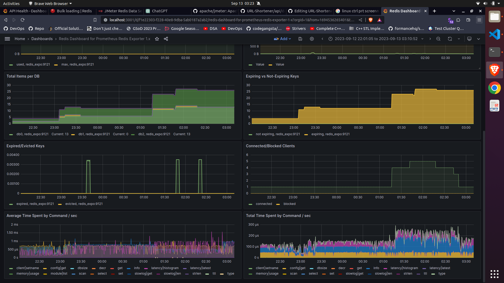

# URL-Shortener

This is an implementation of a URL-Shortener in **Go** with **Redis** as the in-memory database, using a **fixed window counter** algorithm, which is a standardized _rate limiting algorithm_. The goal of this project is to test different rate-limiting algorithms on _client IPs_ and how they affect _hit rates_, as well as to provide real-time analytics for URLs. The current version only contains the APIs with limited performance testing, further versions will contain extensive stress testing alongside an interactive frontend for users. All the components are **dockerised**. The containers are then monitored using **Prometheus** and **Grafana**. 

## Tech-Stack

- **Languages:** Go, YAML, JavaScript
- **Databases:** Redis: used _[RedisInsight](https://redis.com/redis-enterprise/redis-insight/)_ to manage instances
- **Deployment Tools:** Docker: used _[Docker-Compose](https://docs.docker.com/get-started/08_using_compose/)_ to manage multi-container applications
- **API Testing Tools:** [Postman](https://www.postman.com/product/what-is-postman/), [Apache JMeter](https://jmeter.apache.org/)
- **Monitoring Tools:** [Prometheus](https://prometheus.io/) and [Grafana](https://grafana.com/)

## Guide: How to deploy locally

1. Clone the GitHub repository using the following command to your local machine.
	```
	git clone https://github.com/sankalp-12/URL-Shortener
 	```

2. Make sure you have installed _Docker_ and _Docker-Compose_ on your machine. Now, change the working directory to the newly cloned repository.
	```
	cd URL-Shortener
 	```

3. Now, to start all the containers, run the _docker-compose.yml_ file.
   	```
    sudo docker-compose build && sudo docker-compose up
   	```
   Alternatively, a `Makefile` is provided to restart the process in case of any errors. If you face any errors during the executions of the YAML config file, ensure that all the ports required are free on your machine.

4. After execution, run the command: `docker ps` to ensure that all the containers are up and running.
5. Once verified, access the port(9090 by _default_) assigned to the **Prometheus** instance. Navigate to the **Status** option in the panel, and click on the **Targets** option in the drop-down menu. If you see 3 **UP** instances, then Prometheus is successfully scraping the application.
6. Finally, access the port(3031 by _default_) assigned to the **Grafana** instance and start making your dashboards to monitor your application metrics and send alerts. Examples of possible dashboards you can create are given below. 








7. Note that to get metrics for a locally deployed application, you will have to hit the APIs yourself. **Postman** and **JMeter** were used for performance testing of the application to capture the above metrics. For Postman specifically, you can use pre-test scripts written in vanilla JavaScript to automate performance tests. However, if you want to automate stress tests in particular, _JMeter_ is recommended as it allows you to engage in _IP Spoofing_ to test your application from different IPs, in case you have a single machine for load testing.  

 
